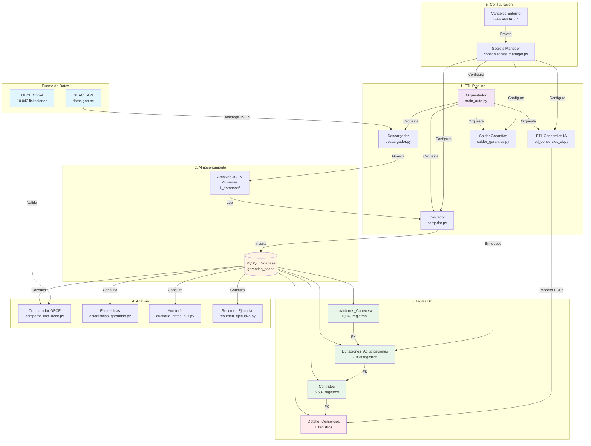
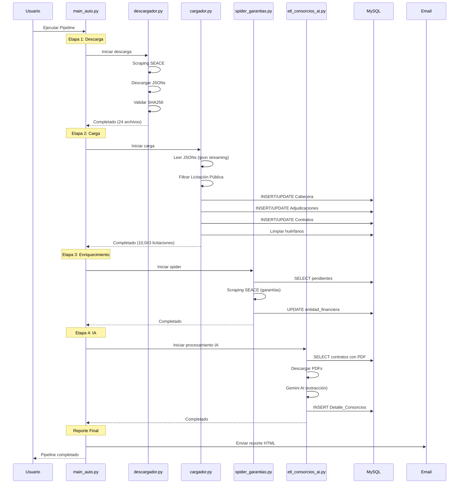
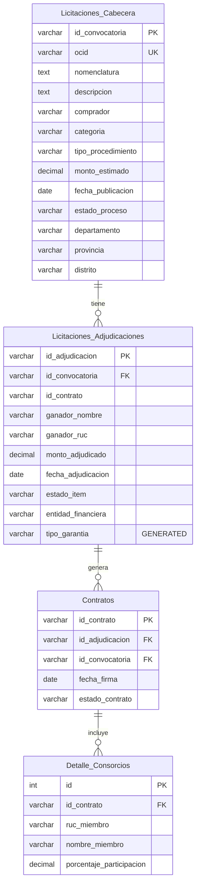
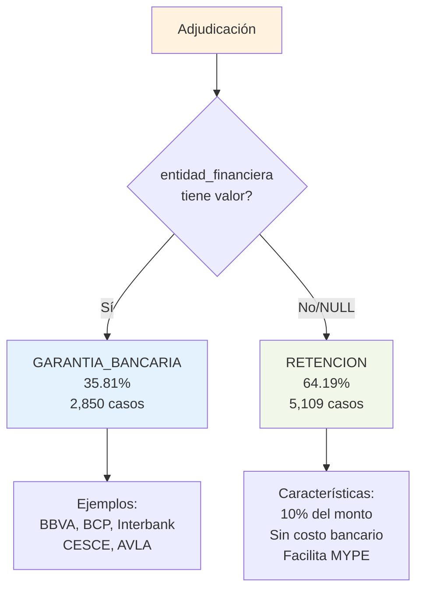
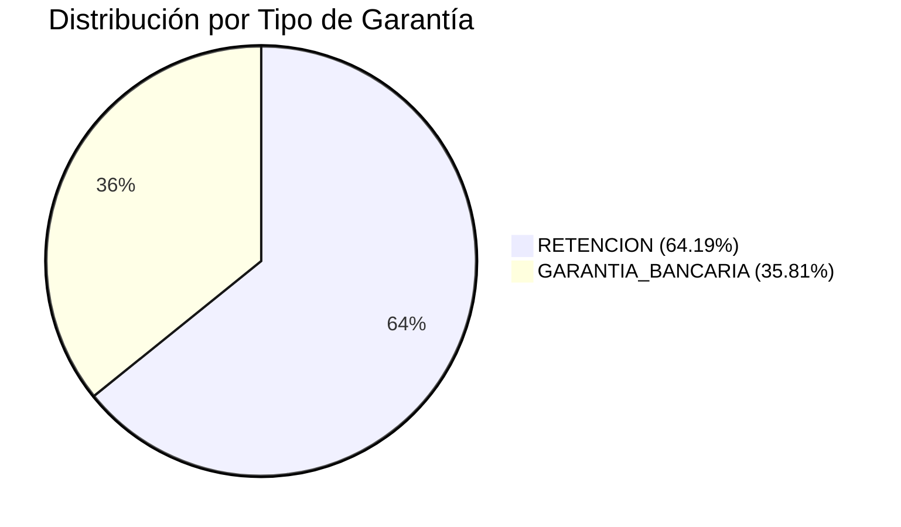
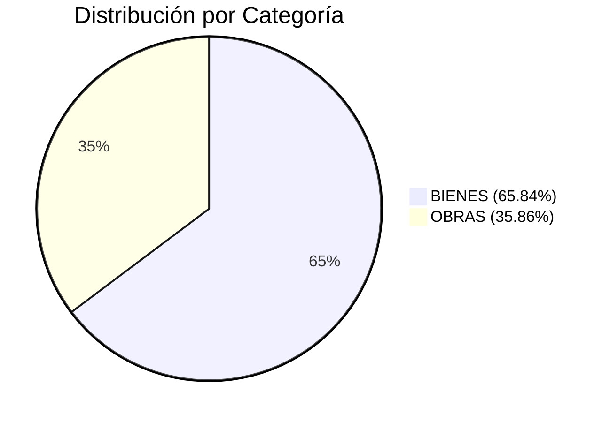
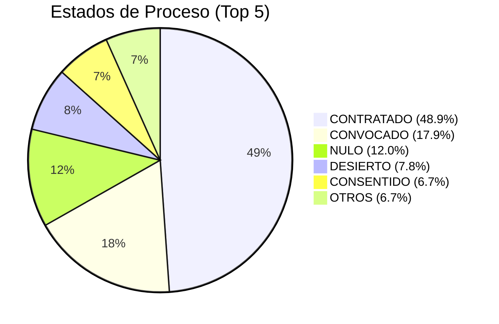
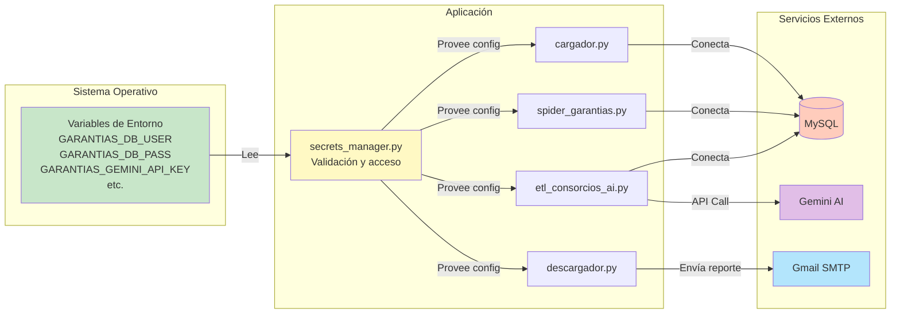
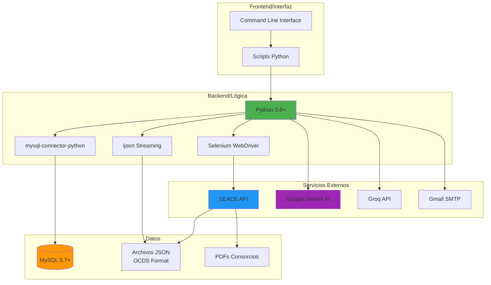

# 🏗️ Arquitectura del Sistema - Proyecto Garantías SEACE

## 📐 Diagrama de Arquitectura General



## 🔄 Flujo de Datos Detallado



## 🗄️ Modelo de Datos



## 🎯 Clasificación de Tipos de Garantía



## 📊 Distribución de Datos







## 🔐 Arquitectura de Seguridad



## 📈 Métricas del Sistema

### Estado Actual (18 Dic 2024)

| Métrica | Valor | Estado |
|---------|-------|--------|
| **Licitaciones** | 10,043 | ✅ 100% coincidencia OECE |
| **Adjudicaciones** | 7,959 | ✅ Completo |
| **Contratos** | 6,687 | ✅ Mapeados |
| **Consorcios** | 0 | ⚠️ Pendiente ETL |
| **Archivos JSON** | 24 meses | ✅ 2024-2025 |
| **Calidad RUC** | 96.26% | ✅ Alta |
| **Calidad Contratos** | 76.76% | ⚠️ Mejorable |
| **Calidad Monto** | 85.37% | ✅ Buena |

### Rendimiento ETL

| Etapa | Tiempo Promedio | Estado |
|-------|----------------|--------|
| Descarga | ~14 segundos | ✅ Rápido |
| Carga | ~0.5 segundos | ✅ Muy rápido |
| Enriquecimiento | ~1 segundo | ✅ Rápido |
| IA Consorcios | Variable | ⚠️ Depende de API |

## 🛠️ Stack Tecnológico



## 📚 Documentación del Proyecto

```
proyecto_garantias/
├── README.md                          ⭐ Este documento
├── ARQUITECTURA.md                    ⭐ Arquitectura detallada
├── QUICKSTART.md                      🚀 Inicio rápido
├── COMO_EJECUTAR.md                   📖 Guía de ejecución
├── SECURITY.md                        🔒 Seguridad
├── GUIA_TIPOS_GARANTIA.md            💰 Interpretación de garantías
├── ANALISIS_RETENCION.md             📊 Análisis normativo
├── REPORTE_AUDITORIA_NULL.md         🔍 Auditoría de calidad
├── RESUMEN_IMPLEMENTACION.md         📝 Historial de cambios
└── ... (15+ documentos adicionales)
```

---

**Última actualización**: 18 de diciembre de 2024  
**Versión**: 2.0  
**Estado**: ✅ Producción
